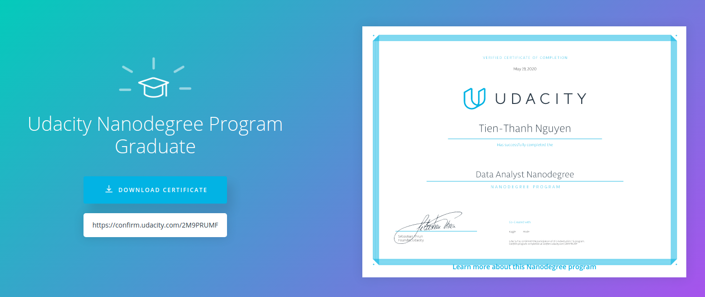

# Udacity - Data Analyst Nanodegree

Data Analyst Nanodegree is aimed to equip all the skills a data analyst need to conduct full, end-to-end analyses harnessing the power of Python, the leading industry programming language for data analysis.

## Modules:

### Module 1: Introduction to Data Analysis
- Learn how to create interactive, shareable data reports with Jupyter Notebooks
- Get set up with Anaconda, the leading package management & deployment solution for data science
- Investigate datasets using two of Python’s most powerful data science libraries, NumPy & pandas

### Module 2: Practical Statistics
- Learn to apply key concepts like Simpson's Paradox, conditional probability, Bayes Theorem & more
- Explore various probability distributions and learn how they apply to hypothesis testing
- Practice conducting invaluable statistical techniques like A/B tests, multiple linear regression & logistic regression

### Module 3: Data Wrangling
- Gather data from multiple sources, including reading saved files, downloading from URLs, scraping web pages, and accessing data from APIs
- Identify data quality issues and use metrics to categorize them by validity, accuracy, completeness, consistency, and uniformity
- Clean data using Python and pandas and test your cleaning code visually and programmatically

### Module 4: Data Visualization with Python
- Understand various pitfalls that can impact the effectiveness and interpretability of visualizations
- Learn how to present data in a wide range of statistically-valid visualizations, including histograms, scatterplots, heatmaps, and more
- Learn how to customize almost any aspect of your visualizations (including how to present multiple variables at once)

## Projects:
### Project 1: [EXPLORE GLOBAL WEATHER TRENDS](https://github.com/t-thanh/data-analyst-nd/tree/master/P01-Explore_Weater_Trend)
Get familiar with SQL, and how to download data from a database. Analyze local and global temperature data and compare global temperature trends.

### Project 2: [INVESTIGATE YOUR OWN DATASET](https://github.com/t-thanh/data-analyst-nd/tree/master/P02-Investigate)
Implement an end-to-end analysis on a dataset of your choice (choose from movie, census, sports, or firearm data!).

### Project 3: [CONDUCT A/B TESTING FOR AN ECOMMERCE BUSINESS](https://github.com/t-thanh/data-analyst-nd/tree/master/P03-ABTest)
Help a business understand its A/B test results and decide whether they should push new changes to their website.

### Project 4: [WRANGLE MESSY DATA FROM MULTIPLE SOURCES](https://github.com/t-thanh/data-analyst-nd/tree/master/P04-Data_Wrangling)
Gather dirty data from a variety of sources, assess its quality and tidiness, then clean and present it graphically.

### Project 5: [VISUALIZE & PRESENT YOUR DATA FINDINGS](https://github.com/t-thanh/data-analyst-nd/tree/master/P05-Communicating_Findings)
Learn sound design principles for visualization, then use a variety of tools & libraries to present your findings.
